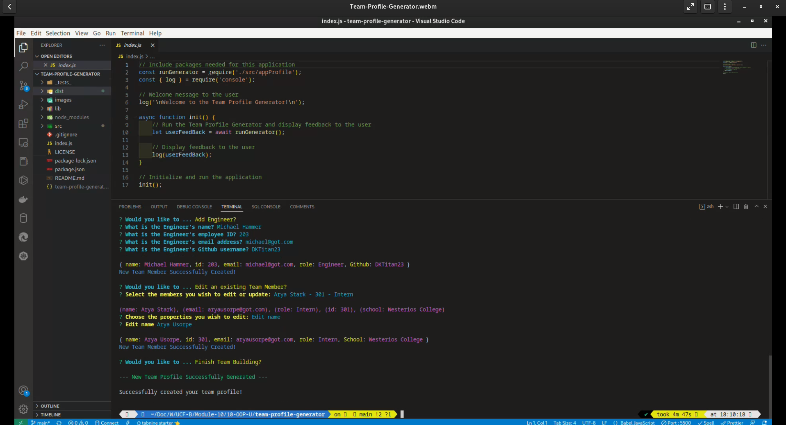

# TEAM PROFILE GENERATOR

    

## Description

This application is a Node.js command-line application that takes in information about employees on a software engineering team, then generates an HTML webpage that displays summaries for each person. The application enables the manager of the team to conveniently send emails to any member of team from the generated webpage. It also allows the manager to access the GitHub pages of engineers in the team.

My objectives for this application is based on the following user story and acceptance criteria;

### User Story

```
AS A manager
I WANT to generate a webpage that displays my team's basic info
SO THAT I have quick access to their emails and GitHub profiles.

```

### Acceptance Criteria

```
GIVEN a command-line application that accepts user input
- WHEN I am prompted for my team members and their information
THEN an HTML file is generated that displays a nicely formatted team roster based on user input
- WHEN I click on an email address in the HTML
THEN my default email program opens and populates the TO field of the email with the address
WHEN I click on the GitHub username
THEN that GitHub profile opens in a new tab
WHEN I start the application
THEN I am prompted to enter the team manager’s name, employee ID, email address, and office number
WHEN I enter the team manager’s name, employee ID, email address, and office number
THEN I am presented with a menu with the option to add an engineer or an intern or to finish building my team
WHEN I select the engineer option
THEN I am prompted to enter the engineer’s name, ID, email, and GitHub username, and I am taken back to the menu
WHEN I select the intern option
THEN I am prompted to enter the intern’s name, ID, email, and school, and I am taken back to the menu
WHEN I decide to finish building my team
THEN I exit the application, and the HTML is generated

```

## Table of Contents

- [Description](#description)
- [Installation](#installation)
- [Usage](#usage)
- [Features](#features)
- [Tests](#tests)
- [Questions](#questions)
- [License](#license)

---

## Installation

To run this command-line application, you will need to install Node.js and once installed, you will run the following command in the root directory of the application:

- npm install

This command will install all dependencies found in the package.json file required by the application to execute.

## Usage

The Team Profile Generator is invoked by using the following command in the root directory of the application:

- node index

[This Team Profile Generator link](https://drive.google.com/file/d/1fXBfH-75GW0r7_bJPNF_Pr3EMf7piItB/view?usp=sharing) shows a demonstration of testing, executing, and exploring the generated HTML and webpage with its features. The HTML file generated in the demo is included here as [index.html](./dist/index.html).

The images below shows some of the application's prompts and feedback.

The application's introduction page.


The prompts for adding the manager.


After providing the name of the manager, the application prompts for other properties and confirms the successful creation of the manager object. The application then prompts the user to add the other members of the team.


The user will follow the application menu and prompts to add or edit other members to the team. The application will confirm the creation or update of each team member.


The application ends by confirming the successful creation of the team profile.



The webpage generated by the [demonstration video](https://drive.google.com/file/d/1fXBfH-75GW0r7_bJPNF_Pr3EMf7piItB/view?usp=sharing).


## Features

In addition to fulfilling the above requirements, the application also has the following features:

1.  The application prevents the user from adding members with the same employee id.
2.  The application allows the user to edit the details of team members except the manager.
3.  It will accept the addition of team members in any order but will always display Engineers before Interns irrespective of the order of entry.
4.  There's no limit to the size of the team.

## Tests

The application uses Jest to test the test scripts in the _test_ directory. The scripts tests the safe instantiation of each Class object and the accurate functionality of its methods. Once in the application root directory, you can run the tests by running the following command:

- npm test

The demonstration video link found [here](https://drive.google.com/file/d/1fXBfH-75GW0r7_bJPNF_Pr3EMf7piItB/view?usp=sharing) provides an example of its usage.

## Questions

If you have any questions, please feel free to reach out to me at: [ikubiti@icloud.com](mailto:ikubiti@icloud.com).

Alternatively, you may find me on GitHub at [https://github.com/ikubiti](https://github.com/ikubiti).

---

## License

Copyright (c) ikubiti. All rights reserved.

Licensed under the [MIT](./LICENSE) license.

